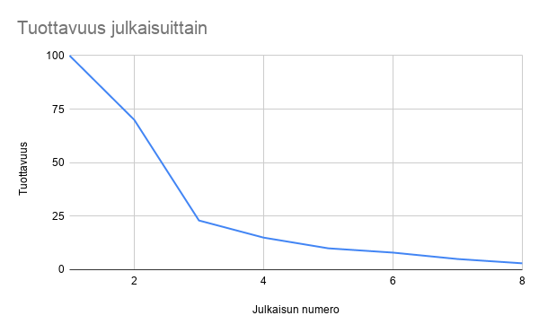
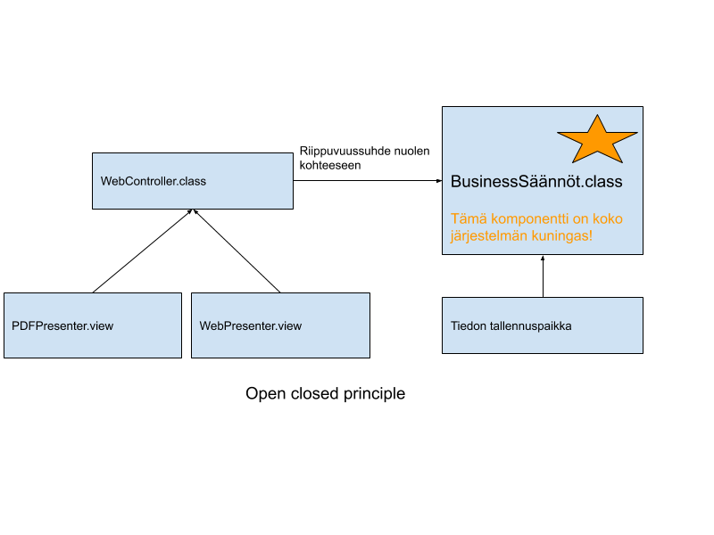
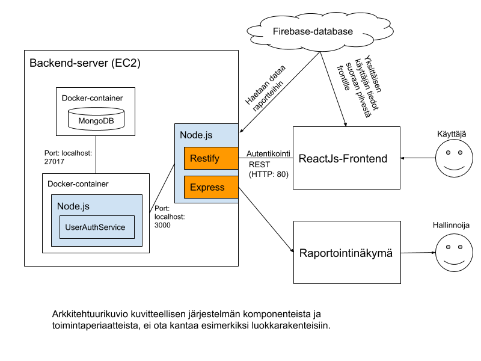
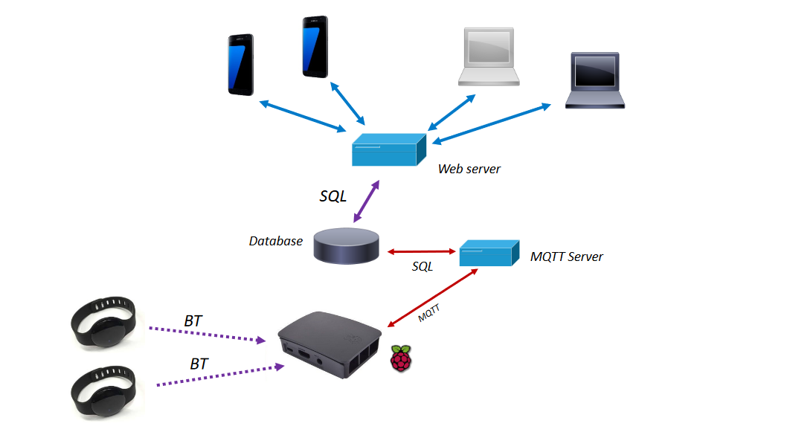
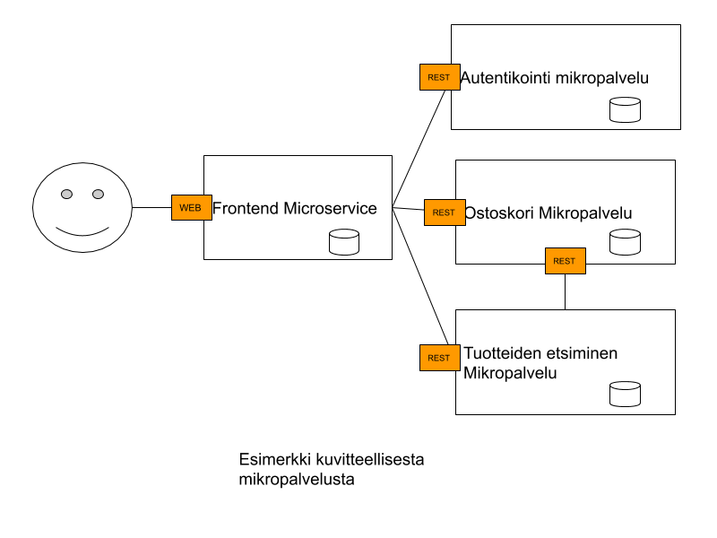

## Sisällysluettelo
* [Ohjelmistoarkkitehtuurit ja patternit](#ohjelmistoarkkitehtuurit-ja-patternit)
* [Eri ohjelmointiparadigmat](#eri-ohjelmointiparadigmat)
* [Esimerkkejä arkkitehtuurikuvauksista](#esimerkkejä-arkkitehtuurikuvauksista)
* [Käytännön arkkitehtuuritoteutuksia](#käytännön-arkkitehtuuritoteutuksia)
* [Tietoliikenneprotokollat](#tietoliikenneprotokollat )
* [Tehtävät](#tehtävät)
<!--Jaksaako tätä ylläpitää manuaalisesesti...-->

# Ohjelmistoarkkitehtuurit ja patternit

Arkkitehtuuriperiaatteet ovat samoja riippumatta minkälainen ohjelmistojärjestelmä on kyseessä, olipa kyseessä konsolisovellus, graafinen käyttöliittymä, peli, kirjanpintojärjestelmä, monisäiejärjestelmä, tietokantasovellus, jne. Nämä periaatteet eivät ole myöskään radikaalisti muuttuneet ohjelmointikielten ja järjestelmien laskentatehojen kehittyessä vuosikymmenien aikana. (Martin R., Clean Architecture).

Pienen ohjelman “hakkeroiminen” kasaan siten että se toimii, ei ole kovin vaikeaa. Ohjelman rakentaminen siten, että sen ylläpito ja kehittäminen on helppoa ja kustannustehokasta, on kokonaan eri asia. Huonosti suunnitellun järjestelmän kehityskustannukset ja uuden koodirivin tuottamisen kustannukset kasvavat jopa eksponentiaalisesti järjestelmän koon kasvaessa.

 (mukaillen Martin R., Clean Architecture) 

 (mukaillen Martin R., Clean Architecture) 

Kehittäjän näkökulmasta tämä on turhauttavaa, koska kaikki haluaisivat olla tuottavia ja tehdä uusia ominaisuuksia niin vauhdikkaasti kuin mahdollista. Robert Martin argumentoi kirjassaan, että järjestelmän helppo muokattavuus (=hyvä arkkitehtuuri) on tärkeämpää kuin järjestelmän kyseisen hetken toiminnallisuus. Yksittäiset uudet toiminnallisuudet ovat kuitenkin aina juuri sillä hetkellä niitä kiireellisimpiä asioita saada lisättyä järjestelmään. Arkkitehtuuri on pitkällä tähtäimellä tärkeämpää, muttei ikinä juuri sillä hetkellä kiireellistä. (Martin R., Clean Architecture).

Hyvin rakennettuun järjestelmään muutosten tekeminen on helppoa, eikä muutoksen tehdäkseen tarvitse muuttaa suurta osaa jo olemassa olevista järjestelmän palasista. (Martin R., Clean Architecture).

Robert Martinin mukaan:
>“Hyvän arkkitehtuurin tavoite on minimoida ihmistyö, joka tarvitaan järjestelmän kehittämiseen ja ylläpitämiseen.”

Vastaavasti hyvä arkkitehti on tiimin edistynein koodari jonka tehtävän Martin kuvaa seuraavasti:
>“Hyvän arkkitehdin tehtävä on ohjata muutakin kehitystiimiä sellaisen arkkitehtuurisuunnittelun (design) toteuttamiseen, mikä maksimoi tuottavuuden.”

Hyvä arkkitehtuuri:
1. Tekee järjestelmästä helposti ymmärrettävän
1. Tekee järjestelmästä helposti kehitettävän
1. Tekee järjestelmästä helposti ylläpidettävän
1. Tekee järjestelmästä helposti deployattavan
1. Minimoi järjestelmän elinkaarikustannukset
1. Maksimoi ohjelmoijien tuottavuuden
(Martin R. Clean Architecture)

Hyvässä arkkitehtuurissa järjestelmän komponentit ja toiminnnot on jaoteltu siten, että komponenttien välillä ei ole tarpeettomia sisäisiä yhteyksiä, jotka hankaloittavat muutosten tekemistä. Tällöin puhutaan komponenttien [“loose coupling”:sta](https://en.wikipedia.org/wiki/Loose_coupling). Toisaalta komponenttien sisällä asioiden tulisi palvella samaa keskeistä tavoitetta tai tarvetta. Komponenttien sisällä pyritään siis saavuttamaan [“high cohesion”](https://en.wikipedia.org/wiki/Cohesion_%28computer_science%29). 
Hyvin rakennetussa järjestelmässä arkkitehti on osannut jakaa järjestelmän toiminnot siten, että loose coupling ja high cohesion tavoitteet saavutetaan. Tässä suunnittelutyössä Robert Martinin listaamista arkkitehtuurisuunnitelun periaatteista (yhteensä 5 kpl) kenties kaksi oleellisinta ovat **Single Responsibility Principle (SRP)** sekä **Open-Closed Principle (OCP)**. (Martin R., Clean Architecture).

**Single Responsibility periaatteen (SRP)** mukaan järjestelmäkomponentilla (oikeastaan SRP puhuu vain luokista, mutta Common Reuse Principle koskee samalla tavalla myös komponentteja) tulisi olla vain yksi syy muutokseen. Martin täsmentää tätä vielä lisää ja sitoo muutoksen tarpeen nimenomaan yhteen sidosryhmään (stakeholder) ja vielä tarkemmin yhteen toimijaan (actor). 
Käytännössä siis, jos järjestelmä hoitaa esimerkiksi palkkatietojen laskemista kolmelle eri toimijalle (talousjohtaja, teknologiajohtaja ja operatiivinen johtaja), niin kaikki heistä tarvitsevat kyseistä tietoa eri tarpeeseen ja eri näkökulmasta. Näin ollen saman “Työntekijä”-luokan ei tulisi hoitaa näiden kolmen eri toimijan tarvitsemia asioita, muuten esimerkiksi talousjohtajan tarvitsemat muutokset saattavat tarpeettomasti vaatia muutoksia myös muiden toiminnallisuuksiin ja näin ollen tehdä järjestelmästä vaikeasti muokattavan. 
Hyvä ratkaisu tähän tarpeeseen olisi erottaa eri toimijoiden tarvitsemat laskennalliset “businesstoiminnot” omiin palveluihinsa (service), jotka ottavat syötteekseen vain kiinteän työntekijän dataobjektin. SRP-periaatteen mukaan toiminnallisuuksien lisäksi omiin komponentteihinsa erotetaan esimerkiksi jonkin asian laskenta ja sen visuaalinen esittäminen, vaikka ne siis liittyvätkin samaan ominaisuuteen (vrt. [kerrosarkkitehtuurit](https://medium.com/@priyalwalpita/software-architecture-patterns-layered-architecture-a3b89b71a057)). (Martin R., Clean Architecture).

**Open-Closed periaatteen (OCP)** mukaan järjestelmän osien tulisi olla avoimia laajennuksille, mutta suljettuja muutoksille. Single Responsibility periaatteen mukaan toimien komponenteille on ensin löydetty omat tehtävänsä. Sitten Open-Closed periaatteen mukaan komponentteja tulee suojella muutoksilta siten, että “pienemmän abstraktiotason” (ei ihan oikea termi tämä) komponentti on riippuvainen “suuremman abstraktiotason” komponentista, mutta ei päinvastoin. 
Eli, jos webjärjestelmässä on vaikka Controller-luokka, joka tarjoaa tietokannasta kysyttyä dataa eteenpäin, niin Controller-luokan ei tule riippua tätä dataa esittävistä komponenteista (eli esimerkiksi prosessoida dataa sellaiseen muotoon mitä vaikka PDF-näkymä sille datalle edellyttää). 
Toisena esimerkkinä talousjärjestelmän liiketoimintasäännöt tulisi olla esitettynä omassa komponentissaan ja tämän komponentin ei tulisi riippua esimerkiksi järjestelmän käyttämästä datan tallennusmuodosta tai varsinkaan dataa käyttävistä komponenteista kuten webcontrollerista. Eli tämä businessääntökomponentti on koko järjestelmän kuningas, josta muut ovat riippuvaisia! Komponentti ei muutu, vaikka tietokantatekniikka alta vaihtuisi, tai vaikka dataa ei enää tarjottaisikaan webjärjestelmästä vaan pelkästään PDF-raportteina. Mutta jos tämä komponentti muuttuu, niin sitten muidenkin pitää muuttua ja kyseessä on ihan aito isompi liiketoiminnallinen muutos. 
Käytännön tasolla oliojärjestelmissä rajapinnat ovat OCP-periaatteen toteuttamisessa oleellinen työkalu, tähän liittyy läheisesti myös Dependency Inversion Principle (DIP). (Martin R., Clean Architecture).

 

Ketterän kehityksen suunnittelun periaatteiden mukaisesti ja myös Martinin mukaan arkkitehtuuripäätökset tulisi tehdä mahdollisimman myöhään ja vasta kun on “pakko”, eli kun on maksimaalisesti validointidataa päätöksen tueksi. Tätä ei kuitenkaan tule sekoittaa siihen, että tehdään huonoja ja hätäisiä arkkitehtuuripäätöksiä, tai ettei olla valmiita tarvittaessa tekemään isojakin arkkitehtuurimuutoksia, kun ymmärrys järjestelmästä ja sen tarpeista lisääntyy. 
Martin listaa mm. seuraavat asiat esimerkkeinä päätöksistä, joiden tekemistä arkkitehtuurisuunnittelun näkökulmasta voi lykätä:
* Tietokantaratkaisua ei tarvitse lukita kehityksen alkuvaiheessa. Jos järjestelmän arkkitehtuuri on rakennettu hyvin, niin tietokannan toteutustekniikalla ei ole suurta merkitystä.
* Webpalvelinta ei tarvitse valita alkuvaiheessa. Jos järjestelmän toiminnallisuudet ja arkkitehtuuri suunnitellaan hyvin, niin varsinainen “jakelukanava” (webbi, mobiiliappi, email-muistutukset, ..) ei ole kovin alkuvaiheessa välttämättä niin oleellinen.
* REST-teknologiaa ei tarvitse valita alkuvaiheessa, koska ylätason arkkitehtuuriratkaisujen ei pitäisi riippua siitä, mikä on järjestelmän rajapinta ulkomaailmaan.

(Martin R., Clean Architecture). 

## Eri ohjelmointiparadigmat

On olemassa [kolme pääohjelmointiparadigmaa](https://fi.wikipedia.org/wiki/Luokka:Ohjelmointiparadigmat) (joiden lisäksi on vielä pienemmän tason paradigmoja). Martinin mukaan nämä kolme paradigmaa ovat: 
* strukturoitu ohjelmointi
* olio-ohjelmointi sekä 
* funktionaalinen ohjelmointi. 
Huomionarvoista on se, että paradigmat eivät oikeastaan tarjoa ohjelmoijalle mitään lisätyökaluja, vaan sen sijaan ainoastaan rajoittavat ohjelmoinnissa sallittuja asioita. 

**Strukturoidun ohjelmoinnin** ansiosta otettiin käyttöön funktiot, jotka mahdollistivat ohjelmien jakaminen pienempiin “aliohjelmiin”. Isommat tietokoneohjelmat voidaan siis koostaa joukosta pienempiä funktioita, jotka on helpompi rakentaa ja toisaalta myös todentaa virheellisiksi (vrt. yksikkötestaaminen). Tällainen ongelman pilkkominen pienemmiksi osiksi (decomposition) on hyvässä arkkitehtuurisuunnittelussa tärkeä käytäntö.

**Olio-ohjelmoinnin** periaatteiden mukaan funktioiden lisäksi pyritään saattamaan yhteen myös kyseisiin funktioihin (toimintoihin) liittyvää dataa. Eli hieman yksinkertaistetusti sanottuna, ohjelma koostuu luokista, joihin on koostettu tietty data ja siihen liittyvät toiminnot (funktiot). Luokat eivät paljasta sisäistä toteutustapaansa, vaan tarjoavat ainoastaan rajapinnan, jonka avulla luokkaa voi käyttää. Tätä toimintojen koostamista kutsutaan *[kapseloinniksi](https://fi.wikipedia.org/wiki/Kapselointi) (encapsulation)* ja se on yksi yleensä olio-ohjelmointiin liitetty ominaisuus. 

Toinen olio-ohjelmoinnin tärkeä periaate on *perintä (inheritance)*. Luokka tai olio voi siis periä ominaisuuksia ja toiminnallisuuksia toiselta luokalta. Perinnän avulla on mahdollista vähentää koodin uudelleenkirjoittamista. Esimerkiksi siis *Auto* ja *Moottoripyörä* voivat molemmat periä ominaisuuksia *Ajoneuvo*-luokalta, mutta toteuttaa osin omia toimintojaan.

Robert Martinin mukaan arkkitehdin näkökulmasta olio-ohjelmoinnin isoin vahvuus on *olioiden monimuotoisuus ([polymorphism](https://en.wikipedia.org/wiki/Polymorphism_%28computer_science%29))*. Monimuotoisuus tarkoittaa, että esimerkiksi yllä olevan esimerkin *Auto*-luokka voi esiintyä myös pelkkänä *Ajoneuvona*, jos se on kutsuvalle taholle riittävä abstraktiotaso. 
Edelleen arkkitehtuurin näkökulmasta tarkasteltuna polymorfismin suurin käytännön hyöty syntyy riippuvuussuhteiden kääntämisestä ([Dependency Inversion Principle](https://en.wikipedia.org/wiki/Dependency_inversion_principle)). Polymorfismin ja DIP-periaatteen avulla on mahdollista rakentaa järjestelmän arkkitehtuuri siten, että korkean tason komponentit eivät riipu alemman tason toteutusyksityiskohdista. 

Springin *Inversion of Control-periaate* ja *[Dependency Injection-pattern](https://www.baeldung.com/inversion-control-and-dependency-injection-in-spring)* on esimerkki [DIP-periaatteen konkreettisesta toteutuksesta](https://springframework.guru/principles-of-object-oriented-design/dependency-inversion-principle/). Spring-sovelluksissa voidaan siis esimerkiksi antaa *Ajoneuvo*-tyyppisiä luokkia (tai rajapintoja) parametreina tietyille palvelu-luokille (service). Sitten sovellus voidaan alustaa joko *Moottoripyörillä* tai *Autoilla*, mutta palvelu-luokkien ei koskaan tarvitse tietää minkä toteuttavan luokan Spring-sovellus on tässä tapauksessa injektoinut. Näin ollen kyseisten palvelu-luokkien toteutuksia ei tarvitse muuttaa vaikka *Auto* ja *Moottoripyörä* muuttuisivatkin ja toisaalta samaa järjestelmää voidaan käyttää useiden ajoneuvotyyppien hallintaan.

Olio-paradigman mukaan ohjelmoiduista järjestelmistä tulee monesti rakenteeltaan kerroksellisia. Kerrosten välillä viestitään rajapintojen avulla, mikä mahdollistaa varsinaisten toteutusteknologioiden vaihtamisen ilman, että rajapinnasta riippuviin kerroksiin tarvitsee tehdä muutoksia. Myös esimerkiksi tietyn kerroksen testaaminen on helpompaa, kun alla oleva kerros voidaan testien ajaksi huijata palauttamaan haluttua syötettä.

Tässä luokkakaaviossa on esitetty esimerkkinä kuvitteellisen web-järjestelmän luokkakaavio seuraten löyhästi UML-mallinnuskieltä. Kaavion perusteella olisi tarkoitus saada lukija nopeasti ymmärtämään, että kyseessä on perinteistä oliomallinnusta, kerrosarkkitehtuuria sekä webjärjestelmien MVC-mallin periaatteita seuraava sovellus.
 

Kolmas pääohjelmointiparadigma, **Funktionaalinen ohjelmointi**, perustuu oleellisesti siihen, että muuttujien arvoja ei muuteta (immutability). Tarvittaessa luodaan uusi muuttuja, johon uusi arvo tallentuu. 
Arkkitehdin näkökulmasta moni ohjelmoinnin ongelma poistuu, jos muuttujan arvo ei ikinä voi muuttua. Tällöin ei voi syntyä ongelmia siitä, että samaa muuttujaa muokataan kahdesta eri paikasta ja eri säikeistä melkein samaan aikaan (concurrent update problem). 
Täydellisen muokkaamattomuuden toteuttaminen käytännössä saattaa sovelluksesta riippuen vaatia huomattavasti laskenta- ja tallenuskapasiteettia ja siksi sitä ei käytännössä kannata välttämättä seurata täysin kirjaimellisesti. Arkkitehtuurisuunnittelun näkökulmasta on hyvä käytäntö erottaa muuttumattomat komponentit (immutable) sellaisista, joille sallitaan muuttuminen (mutable). Sitten muutoksille sallitut kohdat pyritään toteuttamaan siten, että niissä huomioidaan esimerkiksi transaktiot.

**[Event Sourcing](https://martinfowler.com/eaaDev/EventSourcing.html)** on hyödyllinen funktionaaliseen paradigmaan liittyvä ohjelmointimalli (pattern). Event Sourcingin ajatuksena on tallentaa kaikki tilan muutokset, varsinaisen uuden tilan sijaan. Esimerkiksi pankkisovelluksessa siis tallennettaisiin pankkitilin alkuperäinen saldo ja sitten kaikki saldoon kohdistuneet operaatiot (otto/talletus ja summa). Tällöin kunkin hetken saldo (tila) pystyttäisiin laskemaan alkuperäisestä saldosta ajamalla kaikki tallennetut operaatiot. 
Näin toteutettu järjestelmä vaatisi huomattavan paljon muisti- ja laskentatehoa. Kenties voitaisiin kuitenkin tallentaa vaikka aina jokaisen keskiyön saldo ja ainoastaan seuraavan päivän operaatiot, jolloin potentiaalisten samanaikaisuusvirheiden (concurrency errors) määrä vähenisi käytännössä kokonaan, mutta järjestelmä pysyisi kuitenkin myös laskenta- ja tallennuskapasiteetin osalta järkevänä. 
Tunnetuista ohjelmointikielistä [Clojure](https://clojure.org/about/rationale) on suunniteltu ohjelmoitavaksi funktionaalisen paradigman mukaan.
 (Martin R., Clean Architecture). 

 

Kolmen pääparadigman lisäksi kiinnostavaa voi olla nostaa esiin muutamia esimerkkejä käytännön ohjelmointitavoista tai paradigmoista. JavaScript-kieli (ja mm. sitä käyttävä Node.js) [eivät mahdollista säikeiden (Thread) kirjoittamista ohjelmiin](https://www.sohamkamani.com/blog/2016/03/14/wrapping-your-head-around-async-programming/). Sen sijaan JavaScriptissä pitkään kestävät operaatiot (esimerkiksi levylle kirjoittaminen, tietokantahaut, jne.) toteutetaan asynkronisilla takaisinkutsuilla (asynchronous callback). Takaisinkutsumalli on saattanut aiheuttaa ohjelmakoodiin vaikeasti seurattavia toimintoketjuja ja siksi JavaScript-maailmassa yleisempää onkin nykyisin [Promise:jen](https://javascript.info/promise-basics) tai [async/await -syntaksin](https://javascript.info/async-await) käyttäminen. 

Yleensä webjärjestelmässä käyttäjä antaa jonkin uuden syötteen tai tekee muutoksen ja sen seurauksena tapahtuu uuttaa laskentaa ja järjestelmän antamat tulostukset muuttuvat. Facebookin kehittämä React-kirjasto [on suunniteltu ohjelmoitavaksi deklaratiivisen mallin mukaisesti](https://facebook.github.io/flux/docs/in-depth-overview) siten, että järjestelmän näkymien sisällöt määritellään kiinteästi suhteessa näkymistä erotettujen tilamuuttujien arvoihin. 
Kun käyttäjä esimerkiksi tekee näkymässä muutoksen, niin Reactissa ei suoraan päivitetä tähän liittyviä näkymäkomponentteja, vaan ainoastaan tilamuuttujia. Sitten ne näkymät, jotka ovat kiinnostuneita kyseisten tilamuuttujien arvoista renderöivät oman sisältönsä uudelleen ja päivittyvät näyttämään kuten muutoksen edellyttävät. 
Näkymät siis määritellään deklaratiivisesti suhteessa tilamuuttujiin, eikä niitä tarvitse päivittää aina kaikkien mahdollisten muutosten yhteydessä erikseen annettavilla imperatiivisilla käskyillä.

[Reaktiivinen ohjelmointi](https://fi.wikipedia.org/wiki/Reaktiivinen_ohjelmointi) on myös monella tapaa kiinnostava ohjelmointiparadigma esimerkiksi webjärjestelmissä, joissa reagoidaan käyttäjän syötteisiin. Reaktiivisessa ohjelmoinnissa [ohjelma koostetaan virroista](https://stackoverflow.com/questions/1028250/what-is-functional-reactive-programming/1030631#1030631). JavaScriptillä reaktiivista ohjelmointia voi tehdä esimerkiksi [RxJS](https://www.learnrxjs.io/) kirjastolla. Myös esimerkiksi Suomessa [Reaktorilla](https://www.reaktor.com/) työskentelevän [Juha Paanasen](https://github.com/raimohanska) kehittämä [Bacon.js](https://baconjs.github.io/) on tätä paradigmaa toteuttava kirjasto. Virtojen käsitettä on pyritty visualisoimaan [RxJS marbles-sivustolla](https://rxmarbles.com/).

## Esimerkkejä arkkitehtuurikuvauksista

Hyvässä arkkitehtuurikuvauksessa ja -kaaviossa on esitetty järjestelmän toimintaa ja rakentamista kuvaavat ydinasiat. Arkkitehtuurikuvioissa liikutaan eri abstraktiotasoilla ja voidaan tarkastella järjestelmän toimintaa eri näkökulmista. Niiden perusteella tulisi kuitenkin syntyä kuva niistä periaatteista ja säännöistä joilla kyseinen järjestelmän on rakennettu.

Alla olevassa kuviossa on esitetty kuviteellisen web-järjestelmän arkkitehtuurikaavio. Se on arkkitehdin kuvaus mielestään oleellisista komponenteista ja toiminnoista järjestelmässä. Sen perusteella on tarkoitus saada käsitys järjestelmän ydinkomponenteista ja niiden suhteista. Tämä kaavio ei kuitenkaan ota kantaa esimerkiksi palvelun frontendissä käytettyyn luokkarakenteesen tai ohjelmointiperiaatteisiin (pattern).

 

Tässä kaaviossa on esitetty vielä toisena esimerkkinä komponenttitason järjestelmäarkkitehtuuri muistisairaiden vanhusten seurantaan tarkoitetusta järjestelmästä, jossa bluetooth-rannekkeet lähettävät sijaintitietoa, jota sitten olisi tarkoitus näyttää hoitajan mobiili- ja webclienteissä.

 

Arkkitehtuuria, järjestelmää ja sen toimintaa voi pyrkiä kuvaamaan myös muunlaisilla kaavioilla kuten esimerkiksi yllä jo olio-ohjelmointiin liittyen käytetyllä luokkakaaviolla sekä sekvenssikaaviolla.

## Käytännön arkkitehtuuritoteutuksia

Viime vuosina [isojen yritysten piirissä suosituksi](https://divante.com/blog/10-companies-that-implemented-the-microservice-architecture-and-paved-the-way-for-others/) koko organisaation ja järjestelmän rakentamista ohjaavaksi arkkitehtuurimalliksi on noussut niin kutsuttu Mikropalveluarkkitehtuuri (Micro service architecture). [Amazon oli ensimmäisiä tätä mallia soveltaneita yrityksiä](https://thenewstack.io/led-amazon-microservices-architecture/). 
Mikropalveluarkkitehtuurissa isot järjestelmät rakennetaan lukuisista pienistä itsenäisistä palveluista, jotka tarjoavat ulkoisen rajapinnan muiden palveluiden käyttöön. Jokainen mikropalvelu omistaa oman datansa. Esimerkiksi siis käyttäjän tunnistautuminen on oma palvelunsa, ostokori voi olla oma palvelunsa, tuotteiden etsiminen on omansa, jne. Tässä on nähtävissä analogia olio-paradigman mukaiseen ohjelmointiin koko järjestelmän mittakaavassa.
Mikropalveluarkkitehtuuri toteuttaa selkeästi Loose coupling ja High cohesion periaatteita ja se mahdollistaa tiimien sisällä varsin itsenäisen työskentelyn. Mallissa on kuitenkin myös selkeitä haittoja, jotka liittyvät esimerkiksi monen pienen järjestelmän jatkuvaan integrointiin, palveluiden versiointeihin, testaamiseen sekä virheiden paikallistamiseen ja korjaamiseen muiden omistamista palveluista. Mikropalveluiden vastakohtana on perinteisempi monoliittinen arkkitehtuurimalli.

 

## Tietoliikenneprotokollat 

Tiedonsiirtoon käytetyt patternit (esim. [publish/subscribe](https://en.wikipedia.org/wiki/Publish%E2%80%93subscribe_pattern), [request/response](https://en.wikipedia.org/wiki/Request%E2%80%93response)), arkkitehtuurimallit (esim. [REST](https://en.wikipedia.org/wiki/Representational_state_transfer)) sekä protokollapinot (HTTP, TCP/IP, mqtt, ...) ovat myös tärkeitä ohjelmistoarkkitehdin työkaluja. Kun tuntee eri protokollat, osaa valita oman sovelluksen tarpeisiin sopivimman.

## Tehtävät

### Tehtävä 1: 
Monivalintakysymyksiä yllä olevasta lukumateriaalista.

1. Mitkä seuraavista ovat hyvän arkkitehtuurin tunnusmerkkejä tietyssä ohjelmistojärjestelmässä (valitse yksi tai useampi)?
* Järjestelmä on helposti ymmärrettävä
* Järjestelmä on helposti jatkokehitettävä
* Järjestelmä on helposti ylläpidettävä
* Järjestelmä on helposti deployattava

1. Mitkä seuraavista ovat hyvän arkkitehtuurisuunnittelun periaatteita, joita sovelletaan järjestelmän komponenttien suunnittelussa (valitse yksi tai useampi)?
* Loose coupling
* High integrity
* Low fidelity
* High cohesion

1. Open-Closed periaatteen (OCP) mukaisesti (valitse yksi tai useampi):
* Kaikille järjestelmän toimijoille (stakeholder tai actor) tulisi rakentaa oma luokka (class).
* Järjestelmän komponenteilla tai luokilla tulisi olla vain yksi syy muutokseen.
* Järjestelmän osien tulisi olla avoimia laajennuksille, mutta suljettuja muutoksille.

1. Mitkä seuraavista asioista ovat arkkitehtuurisuunnittelun näkökulmasta suhteellisen epäoleellisia asioita (valitse yksi tai useampi)?
* Tietokannan toteutustekniikka
* Järjestelmän eri sidosryhmien tarpeiden ja tavoitteiden ymmärtäminen
* Järjestelmän lopullinen jakelukanava (web, mobiili, ….)

1. Mikä seuraavista on olio-ohjelmointiparadigman tärkein anti ohjelmistoarkkitehtuureihin (valitse yksi)?
Kapselointi (encapsulation)
* Monimuotoisuus (polymorfismi)
* Event sourcing
* Ohjelman pilkkominen osiin (decomposition)

1. Spring-sovelluskehys seuraa ennen kaikkea mitä ohjelmointiparadigmaa (valitse yksi)?
Funktionaalinen ohjelmointi
* Olio-ohjelmointi
* Strukturoitu ohjelmointi
* Reaktiivinen ohjelmointi

1. Mitkä seuraavista ovat mahdollisia arkkitehtuurikaavion näkökulmia (valitse yksi tai useampi)?
* Sekvenssikaavio
* Luokkakaavio
* Komponenttitason järjestelmäarkkitehtuurikaavio

1. Mitkä seuraavista ovat mikropalveluarkkitehtuurin hyötyjä (valitse yksi tai useampi)?
* Kehitystiimien itsenäisyys
* Tiimirajat ylittävä helppo virheiden paikallistaminen
* Palveluiden versioiminen
* Koko järjestelmän testaaminen

### Tehtävä 2:
[Redux](https://redux.js.org/tutorials/essentials/part-1-overview-concepts) on kirjasto, jota käytetään monesti React-sovellusten yhteydessä. Reduxin tarkoitus olisi selkeyttää sovelluksen tilan hallintaa tilanteissa, joissa tila uhkaa hajautua sekavasti eri komponentteihin. 
Reduxin käyttäminen perustuu omaan pieneen suunnittelumalliin, eli arkkitehtuurimalliin. Malli koostuu kolmesta ydinkomponentista: [Actioneista](https://redux.js.org/basics/actions), [Reducerista](https://redux.js.org/basics/reducers) sekä [Säiliöstä](https://redux.js.org/basics/store) (Store). Tässä mallissa Actionit kertovat mitä halutaan tehdä (ja välittävät tämän tiedon Reducerille). Reducer päättää miten Actionin haluama asia tehdään ja miten uusi tila määritellään. Reducer-komponentin idea pohjautuu funktionaalisen ohjelmoinnin [reduce (toiselta nimeltä fold tai accumulate) funktioon](https://en.wikipedia.org/wiki/Fold_%28higher-order_function%29). (Funktionaalisen ohjelmoinnin Reduce-funktiolle annetaan parametrina lista ja tavoitteena on palauttaa vain yksi redusoitu/acculumoilitu arvo. Redusoivaa funktiota sovelletaan listan alkioihin (tai tässä tapauksessa tämänhetkiseen tila-arvoon) ja lopulta palautetaan lopputulos, joka syntyy redusoivan funktion soveltamisesta yksi kerrallaan listan arvoihin.) Funktionaalisen ohjelmoinnin periaatteiden mukaisesti Reducer ei muokkaa vanhaa tilaa, vaan palauttaa kokonaan uuden tilan, Reducerin tulee muutenkin olla ns. ["puhdas funktio"](https://en.wikipedia.org/wiki/Pure_function) ilman sivuvaikutuksia.

 

Reduxia voi käyttää (ja sen periaatteita seurata) myös ilman Reactia. Tiedostossa [Reduxperiaatteet.js](src/Reduxperiaatteet.js) on luotu tiedostopohja, josta löytyy metodipohja Reducer-metodille, kahdelle Action-metodille sekä Redux säiliön luomiselle (lisäksi samassa src-kansiossa on npm:lle tarpeellinen [package.json](src/package.json)). Sinun tehtäväsi on täydentää Reducer-metodia sekä kahta Action metodia siten, että Redux-säiliö palauttaa tiedostossa kuvatun halutun lopputuloksen. Tässä tapauksessa siis lisäämme ja poistamme säiliöön yksinkertaisia väreihin liittyviä tietoja. Tärkeintä tässä tehtävässä olisi tutustua Reduxin arkkitehtuurin toimintaperiaatteita Reduxin dokumentaatiota ja googlea hyödyntäen ja yrittää toteuttaa tämä pieni ohjelma Reduxin arkkitehtuuriperiaatteita seuraten. Reduxista ja sen periaatteista voi lukea myös esim [täältä](https://redux.js.org/introduction/getting-started). (muista ajaa src-kansiossa *npm install* komento alkuun, jolloin npm asentaa Redux-kirjaston, johon on määritelty riippuvuus src-kansion package.json-tiedostossa).

### Tehtävä 3:
1. Piirrä arkkitehtuurikaavio komponenteista ja teknologioista sekä luokkakaavio luokista ohjelmistoprojekti2-järjestelmästänne mikäli järjestelmänne on arkkitehtuurillisesti riittävän haastava ja kiinnostava. Jos järjestelmänne on arkkitehtuurillisesti hyvin simppeli, niin tätä vaihtoehtoa ei voi tehdä.

1. Toinen vaihtoehto on laatia arkkitehtuurikuvaukset (järjestelmä- ja luokkakaavio) järjestelmästä, jolla toteuttaisit reaaliaikaisesti toimivan web/mobiili-chatalustan, jossa käyttäjät voivat lähetellä viestejä toisilleen eri kanavilla sekä yksityisesti kahden käyttäjä kesken. 
Chattia voi siis käyttää 2-1000 käyttäjää kerrallaan samassa chatissa. 
Jos haluat tehtävään vielä lisää haastetta, niin suunnittele arkkitehtuuriehdotuksesi siten, että chatti toimisi esimerkiksi isolla festivaalialueella sisäisenä viestintäkanavana [bluetooth mesh-verkon](https://en.wikipedia.org/wiki/Bluetooth_mesh_networking) avulla kaikille siellä paikalla oleville ihmisille vaikka internetyhteyttä ei olisikaan käytettävissä. 

Arkkitehtuurikaaviot voit piirtää haluamallasi työkalulla, esimerkiksi google-slides riittää ihan hyvin. Palauta tehtävässä lopulta siis kaksi png-kuvatiedostoa arkkitehtuurikaavioista (järjestelmätason arkkitehtuurikaavio sekä luokkatason kaavio) 

### Seminaaritehtävä 1 (täydennetään seminaarivaiheessa):
Tutustu [FRP-ohjelmointiin](https://stackoverflow.com/questions/1028250/what-is-functional-reactive-programming/1030631#1030631) ja tee (tietynlainen) ohjelma bacon.js:llä tai RxJS:llä.

### Seminaaritehtävä 2:
Mikropalveluihin perustuvan pienen palvelun rakentaminen (esim autentikointipalvelu pyörii omana palvelunaan).

### Lähteet:
* Martin R., Clean Architecture, Pearson Education, 2018.