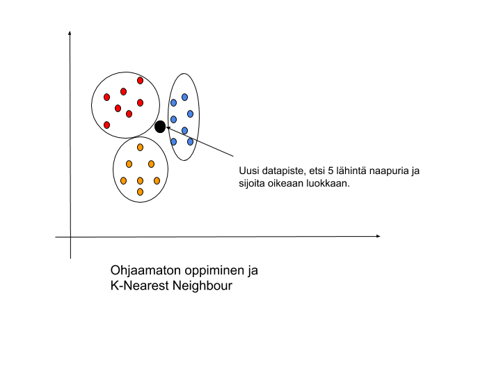

## Sisällysluettelo

# Johdanto koneoppimiseen

Koneoppimisessa on kyse siitä, että datan avulla tietokone voidaan opettaa ratkaisemaan ongelmia tietyssä toimintaympäristössä ilman varsinaista ohjelmointia. Dataa kyseisestä ongelmakentästä täytyy kuitenkin olla paljon, jotta *koneoppimismalli* voidaan kouluttaa. Ongelmakentän tulee myös olla tarkasti rajattu, eikä samalla datalla koulutettua mallia voida siirtää toisen ongelman ratkaisuun. Termiä *tekoäly* tunnutaan käyttävän monesti myös synonyyminä koneoppimisesta ja toisaalta mikä tahansa tavallinen ohjelmoitu algoritmi saatetaan nykyään luokitella valtamediassa "tekoälyksi". 

Yksinkertaisia ongelmia voi mallintaa lineaarisilla funktioilla. Kerätyn datan perusteella, voimme laskea lineaariselle *tavoitefunktiolle (objective function)* painokertoimet ja tehdä ennusteen uudelle datapisteelle. 

Usein reaalimaailman asiat ja ilmiöt ovat sen verran monimutkaisia, että lineaarinen ennustemalli olisi hyvin epätarkka. Tällöin voidaan käyttää sen sijaan epälineaarista tavoitefunktiota.

Edelliset ennustemallit ovat vielä ihmiselle helposti ymmärrettäviä. Kuitenkin vielä epälineaarisia ennustemalleja parempi on yleensä neuroverkkoihin pohjautuva ennustemalli. Neuroverkkoa voi ajatella samanlaisena (mutta monimutkaisena) matemaattisena funktiona, jossa on painokertoimet kuten lineaarisessa ja epälineaarisessa tavoitefunktiossa. Neuroverkoissa painokertointen määrittäminen vain on korkeamman asteen matematiikkaa. Tämä matemaattinen mallinnustapa on saanut inspiraationsa ihmisaivojen neuroverkoista, jotka aktivoituvat (painottuvat) niiden käytön mukaan. Neuroverkkojen yhteydessä puhutaan myös syväoppimisesta (deep learning), mikä viittaa neuroverkon kerrosten syvyyteen. Neuroverkkoja voi käyttää varsin sujuvasti ymmärtämättä niiden tarkkaa matemaattista toteutusta.
 

## Miten kone oppii

 

Koneen opettamiseen on kolme erilaista tapaa, **Ohjattu oppiminen, ohjaamaton oppiminen ja vahvistusoppiminen**. Eri tavat soveltuvat erikaltaisten ongelmien ratkaisemiseen.  

**Ohjatussa oppimisessa (supervised learning)** annamme koneelle ison joukon *merkittyä dataa (labelled data)*. Konelle voidaan siis antaa esimerkiksi 1000 kuvaa, joissa esiintyy kissa (tai rikkoutunut putki tai syöpäkasvaimen esivaihe). Tai koneelle voidaan antaa lauseita, joiden on luokiteltu sisältävän vaikka 50% "politiikkaa" ja 30% "luonnonsuojelua". Datan merkitseminen pitää tyypillisesti tehdä manuaalisena käsityönä. Kun kone on siis ajanut esimerkiksi 1000 kissakuvaa neuroverkkoon, niin se osaa tämän rakentamansa *mallin* avulla tunnistaa esiintyykö jossain tuntemattomassa kuvassa kissa. Koulutuksen aikana voidaan säätää mallin *hyperparametereja*, jotka vaikuttavat siitä kuinka hyvä mallista tulee. (Tekoäly bisneksen uudet työkalut, 2019).

**Ohjaamattomassa oppimisessa (unsupervised learning)** koneelle annetaan vain joukko dataa ja koneen annetaan itse tunnistaa datasta samankaltaisuuksia ja jakaa data joukkoihin. Mallin *hyperparametreja* säätämällä kone saadaan painottamaan datan luokittelussa erilaisia asioita. Ohjaamattoman oppimisen hyvä puoli on se, ettei dataa tarvitse luokitella itse, mutta toisaalta ohjaamaton oppiminen soveltuu vain rajattuihin ongelmiin, kuten poikkeavuuksien löytämiseen, asiakaryhmien luokitteluun jne. Ohjaamattoman oppimisen eräs mielenkiintoinen sovellutus on *K-Nearest Neighbours-algoritmiin* perustuva suosittelu. Jos esimerkiksi verkkokaupan asiakkaat on luokiteltu erilaisiin ryhmiin, niin uusi asiakas voidaan hänen käyttäytymisensä perusteella luokitella kuuluvaksi tiettyyn ryhmään ja suositella hänelle esimerkiksi samoja tuotteita, joita muut sen ryhmän asiakkaat ovat ostaneet. (Tekoäly bisneksen uudet työkalut, 2019).

 

Ohjattu ja ohjaamaton oppiminen toimivat siis alla olevassa kuvassa esitettyjen vaiheiden mukaisesti.
 

**Vahvistusoppimisessa (reinforcement learning)** koneen annetaan itse kokeilla ja tehdä virheitä "keppi ja porkkana"-mallilla. Vahvistusoppimista varten rakennetaan simulaatioympäristö, jossa koneelle annetaan pisteitä sen toiminnasta. Vahvistusoppiminen toimii hyvin esimerkiksi erilaisten pelien, vaikkapa shakin, kouluttamisessa. Tietokone voi pelata miljoonia pelejä itseään vastaan ja "simulaatioympäristö" antaa palautetta yksinkertaisimmillaan vain siitä, voittiko kone pelin. Monessa oikean maailman ongelmassa palautesykli koneen tekemien valintojen ja onnistumisen välillä voi olla hyvin pitkä (helposti vaikka useita viikkoja), jolloin kone oppii hyvin hitaasti. Samaten simulaatioympäristön rakentaminen voi olla haastavaa. Käytännön maailmassa itseajavia autoja pyritään kouluttamaan vahvistusoppimisen avulla. Ihminen voi siis esimerkiksi istua auton kyydissä ja antaa jatkuvasti pisteitä koneen tekemistä valinnoista.

 

## Koneoppiminen käytännössä

<!---tensorit selitetään (moniulotteinen taulukko)-->

## Tehtävät

### Lähteet:
* Kananen H., Puolitaival H., Tekoäly bisneksen uudet työkalut, Alma Talent, 2019.
