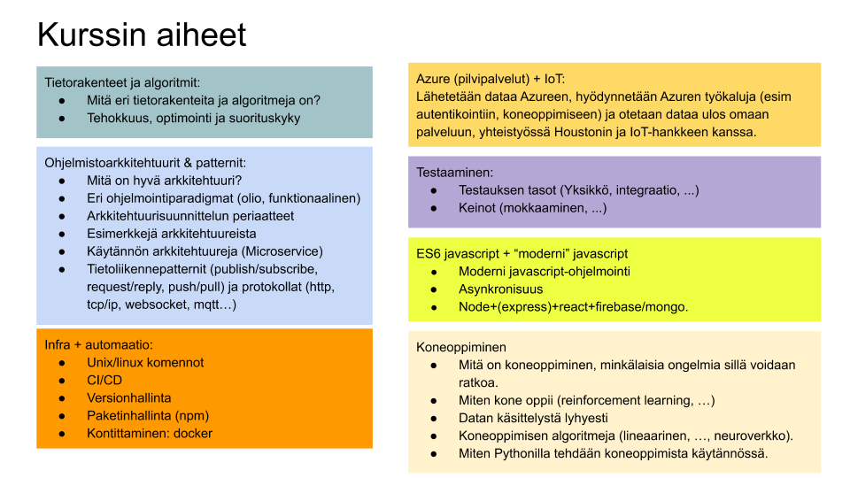

# Ohjelmistokehityksen teknologioita, syksy 2020

Tervetuloa kurssille!

Ohjelmistokehittäjän työ on suurimmaksi osaksi muuta kuin jonkin tietyn ohjelmointikielen syntaksin suvereenia hallintaa. Tämän kurssin tavoitteena on esitellä ohjelmistokehittäjälle tärkeitä taitoja, työkaluja ja tekniikoita, joita ei suoraan ole tullut esille ohjelmoinnin peruskursseilla tai projektityökursseissa. Kurssi toimii samalla myös tukikurssina ohjelmistoprojekti 2-kurssille, jossa tämän kurssin asioita päästään soveltamaan käytännössä.

Opettajina kurssilla toimivat Ohto Rainio ja Teemu Havulinna (etunimi.sukunimi@haaga-helia.fi).

## Linkit

* [Opintojaksokuvaus](https://opinto-opas.haaga-helia.fi/course_unit/SWD4TN023)
* [Teams](https://teams.microsoft.com/)

## Kurssin suoritustapa
Kurssin alkupuoliskolla esitellään viikoittain eri aiheita ja opiskelijat tekevät niihin liittyviä harjoitustehtäviä. Jokaisesta esiteltävästä aiheesta on myös mahdollista tehdä laajempi seminaaritehtävä kurssin jälkimmäisellä puoliskolla. Seminaarivaiheessa, kurssin jälkimmäisellä puoliskolla, jokainen opiskelija valitsee kurssin aiheista itseään eniten kiinnostavan ja tekee siihen liittyvän seminaaritehtävän. Seminaaritehtävän voi valita joko opettajien ehdotuksista tai seminaaritehtävän aihetta voi ehdottaa myös itse. Seminaaritehtävä voi liittyvä läheisesti opiskelijan ohjelmistoprojekti 2-projektiin. Saman seminaariaiheen valinneet opiskelijat osallistuvat sen aiheen yhteiseen seminaariin, jossa analysoidaan ja kommentoidaan myös muiden opiskelijoiden seminaaritöitä. Lopuksi järjestetään vielä mahdollinen yhteinen seminaari, jossa jokaisen pienemmän seminaarin tärkeimmät (tai parhaat) tulokset esitellään kaikille.

## Opintojakson päivämäärät (alustava, voi muuttua)

<table>
<thead><tr><th>Päivämäärä</th><th>Aihe</th></tr></thead><tbody>
 <tr><td>pe 28.8.</td><td>Kurssin johdanto, ympäristöt ja perustason Python 
 <a href="00_linux_ja_python">Oppimateriaali ja tehtävät</a> 
 
Video 1: <a href="https://web.microsoftstream.com/video/3984ea5c-7782-484c-af51-ce6d50b049ad">kurssin yleiset käytännöt ja johdanto 1. tehtävään</a> 
Video 2: <a href="https://web.microsoftstream.com/video/bff8f1a1-025d-4c13-8287-7721032be43c">Python-ohjelmointi</a>  
<a href="00_linux_ja_python/src/">Lähdekoodit</a>
 </td></tr>
 <tr><td>pe 4.9.</td><td>Tietorakenteet ja algoritmit 
 <a href="01_tietorakenteet_ja_algoritmit">Oppimateriaali ja tehtävät</a> </td></tr>
 <tr><td>pe 11.9.</td><td> <a href="02_ohjelmistoarkkitehtuurit_ja_patternit">Ohjelmistoarkkitehtuurit ja patternit</a></td></tr>
 <tr><td>pe 18.9.</td><td><a href="02_ohjelmistoarkkitehtuurit_ja_patternit">Ohjelmistoarkkitehtuurit ja patternit</a>, vierailija <a href="https://neverthink.tv/">Neverthink.tv:ltä</a></td></tr>
 <tr><td>pe 25.9.</td><td>Testaaminen</td></tr>
 <tr><td>pe 2.10.</td><td>Infra + automaatio</td></tr>
 <tr><td>pe 9.10.</td><td>ES6 / JavaScript, node, mongo</td></tr>
 <tr><td>pe 16.10.</td><td>Koneoppiminen</td></tr>
 <tr><td><del>pe 23.10.</del></td><td><del>Intensiiviviikko</del></td></tr>
 <tr><td>pe 30.10.</td><td>Azure</td></tr>
 <tr><td>pe 6.11.</td><td>Azure</td></tr>
 <tr><td>pe 13.11.</td><td>Seminaarityön tekemistä</td></tr>
 <tr><td>pe 20.11.</td><td>Seminaarityön tekemistä</td></tr>
 <tr><td>pe 27.11.</td><td>Seminaarityön tekemistä</td></tr>
 <tr><td>pe 4.12.</td><td>Seminaariesityksiä</td></tr>
 <tr><td>pe 11.12.</td><td>Seminaariesityksiä</td></tr>
 <tr><td>pe 18.12.</td><td>Seminaariesityksiä</td></tr>
</tbody></table>

## Aiheet

1. [Linux ja Python](00_linux_ja_python)

1. [Tietorakenteet ja algoritmit](01_tietorakenteet_ja_algoritmit)

1. [Ohjelmistoarkkitehtuurit ja patternit](02_ohjelmistoarkkitehtuurit_ja_patternit)

1. [Testaaminen](03_testaus)

1. [Infra + automaatio](04_infra_ja_automaatio)

1. [ES6 / JavaScript, node, mongo](05_es6_node_mongo)

1. [Koneoppiminen](06_koneoppiminen)

1. [Azure](07_azure)

## Viestintäkanavat

Tällä kurssilla oppitunnit järjestetään MS Teams -palvelussa. Teams tarjoaa myös luontevan kanavan kysyä ja keskustella oppituntien ulkopuolella. Jos jäät jumiin tehtävän kanssa tai et ymmärrä materiaaleja tai tehtävänantoja, kysy rohkeasti vinkkejä Teamsissa. Todennäköisesti samaa ongelmaa pohtii kanssasi myös moni muu, joten lähetäthän sisältöä ja tehtävänantoja koskevat kysymykset yhteiselle kanavalle eikä yksityisviestinä.

Kurssilla suositellaan käytettävän Teamsin työpöytäsovellusta. Kirjautuminen Teamsiin tapahtuu Haaga-Helian opiskelijatunnuksella.

Liittymisohje kurssin työtilaan löytyy sähköpostitse lähetetystä tiedotteesta.

* [Teams Quick Start -ohje (pdf)](https://download.microsoft.com/download/D/9/F/D9FE8B9E-22F5-47BF-A1AB-09539C41FCD0/Teams%20QS.pdf)
* [Teams](https://teams.microsoft.com/)
* [Teams-lataussivu](https://teams.microsoft.com/downloads)

## Työkalut

Kurssilla käytetään lukuisia eri teknologioita ja työkaluja, joten joudut todennäköisesti tekemään tietokoneellesi lukuisia erilaisia asennuksia. 

Ohjelmistojen asentaminen ja käyttäminen eri käyttöjärjestelmillä poikkeaa toisistaan merkittävästi, minkä lisäksi saman ohjelmiston eri versiot toimivat joskus hyvin eri tavoilla. Asennus- ja yhteensopivuusongelmien minimoimiseksi kurssilla suositellaan vahvasti oman erillisen Linux-virtuaalikoneen asentamista kurssin tehtävien tekemistä varten. Virtuaalikoneeseen tekemäsi asennukset eivät vaikuta tietokoneesi normaaliin käyttöön, ja käyttämällä virtuaalikonetta saat käyttötukea myös kurssin puolesta. 

Linux voidaan asentaa myös tietokoneen pääkäyttöjärjestelmäksi tai "dual boot"-vaihtoehdolla nykyisen käyttöjärjestelmän rinnalle, mutta näitä vaihtoehtoja ei kurssin puolesta tueta.

Mikäli sinulla on valmiiksi käytössäsi Linux tai muu Unix-pohjainen käyttöjärjestelmä, kuten macOS, voit käyttää sitä kurssilla. Myös Raspberry Pi tai etäyhteydellä käytettävät Linux-ympäristöt, kuten [DigitalOcean](https://www.digitalocean.com/github-students/), sopivat kurssin tarkoituksiin, mutta  niihin pystymme tarjoamaan vain vähäistä käyttötukea.

Lisää ohjeita löydät kurssin [ensimmäisen viikon materiaalista](00_linux_ja_python).

## Arviointi

Kurssi arvioidaan asteikolla 0-5. Kurssin arviointi perustuu viikkoaiheiden yhteydessä suoritettuihin tehtäviin (60% arvosanasta) sekä kurssin toisella puoliskolla tehtävään seminaarityöhön (40%).

## Lähteiden käyttäminen

Tämän kurssin materiaali perustuu suurelta osin valmiisiin netistä löytyviin dokumentaatioihin ja tutoriaaleihein. Tällä sivulla eri aihealueiden yhteydessä tarjotaan linkkejä aihetta koskeviin materiaaleihin, mutta **joudut sen lisäksi merkittävissä määrin etsimään itse tietoa aiheista**.

Ohjelmointiongelmiin löytyy usein valmiita tai osittaisia ratkaisuja ympäri Internetiä niin keskustelupalstoilta kuin tutoriaaleista. Huonossa tapauksessa löydät toimivan ratkaisun ongelmaasi, mutta et osaa aivan tulkita mitä löytämäsi koodi tekee ja miksi se ratkaisee ongelmasi. Ammattimaisessa ohjelmistokehityksessä tästä seuraa mahdollisesti suuriakin vahinkoja.

Nettilähteiden hyödyntäminen ja niistä mallin ottaminen on sallittua ja kannustettavaa, mutta et saa vain kopioida ratkaisuja, vaan sinun tulee ymmärtää, miten koodisi toimii. Lisäksi, erityisesti koska kyseessä on korkeakoulun opintojakso, sinun tulee merkitä lähteet lainatessasi esimerkiksi StackOverflow:sta löytämääsi koodia. Lähdeviitteeksi riittää esimerkiksi verkkosivun osoite kommenttina lainatun koodin yhteydessä, tai käyttämäsi lähteen käyttöehtojen mukainen muu lähdeviite.
